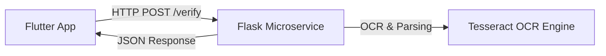

# Insurance Verification Python Microservice

This is a Python microservice built with **Flask** to handle insurance card verification, OCR extraction, and policy parsing.

## System Architecture



* **Frontend**: Flutter application.
* **Backend**: Flask Python microservice.
* **Security**: API Key authentication via `Authorization` header.
* **OCR System**: Extracts text using Tesseract OCR, with built-in regex rules for structure detection and an offline mock parser fallback.

## API Documentation

### Endpoints

#### 1. GET `/`
Root metadata checking if OCR engine libraries are loaded.

#### 2. GET `/health`
Health check status.

#### 3. POST `/verify` (Authenticated)
Upload insurance card images (PNG, JPG, JPEG) or PDF documents.
* **Headers**: `Authorization: Bearer dev-key-12345`
* **Body**: `file` (form-data file)
* **Response**:
  ```json
  {
    "success": true,
    "message": "Insurance card verified successfully.",
    "extracted_fields": {
      "policy_number": "POL-99182736",
      "member_id": "BCBS-789012",
      "policy_holder": "Emily Thompson",
      "validity": "2027-12-31",
      "coverage": "BlueCross PPO Premium - 90% In-Network, $500 Deductible"
    },
    "detected_insurer": "Blue Cross Blue Shield",
    "confidence_score": 0.95,
    "processing_time_ms": 12.50
  }
  ```

---

## Local Setup Instructions

### Prerequisites
1. Python 3.8+ installed (tested on Python 3.14.5).
2. (Optional for local OCR) Install [Tesseract OCR](https://github.com/tesseract-ocr/tesseract) on your system. Ensure `tesseract` is added to your system's PATH.

### Installation
1. Navigate to this directory:
   ```bash
   cd insurance_service
   ```
2. Create a virtual environment:
   ```bash
   python -m venv venv
   ```
3. Activate virtual environment:
   * Windows: `venv\Scripts\activate`
   * macOS/Linux: `source venv/bin/activate`
4. Install dependencies:
   ```bash
   pip install -r requirements.txt
   ```
5. Run the server locally:
   ```bash
   python main.py
   ```
   The service will start running at `http://127.0.0.1:8000`.

---

## Production Deployment

For production deployments, it is recommended to run the app using `gunicorn` behind an Nginx reverse proxy:

```bash
pip install gunicorn
gunicorn -w 4 -b 0.0.0.0:8000 main:app
```
